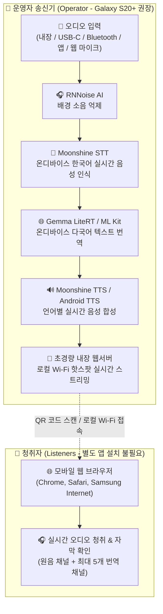
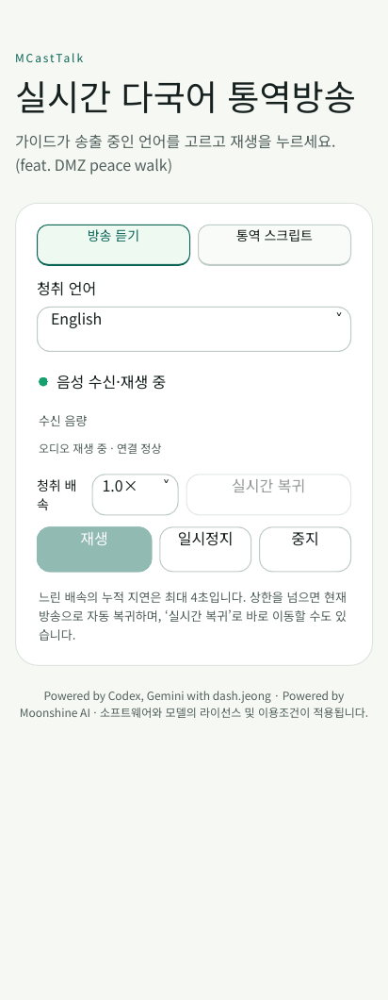
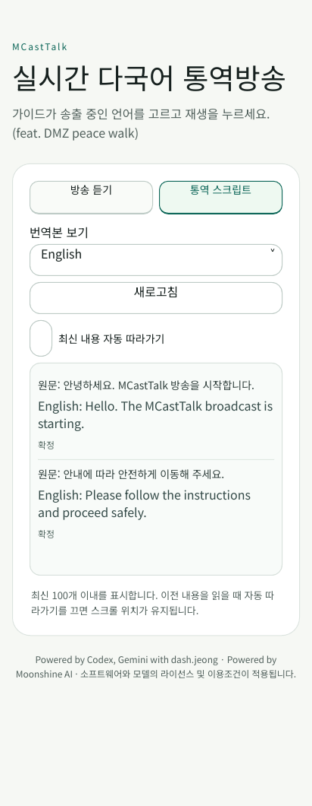
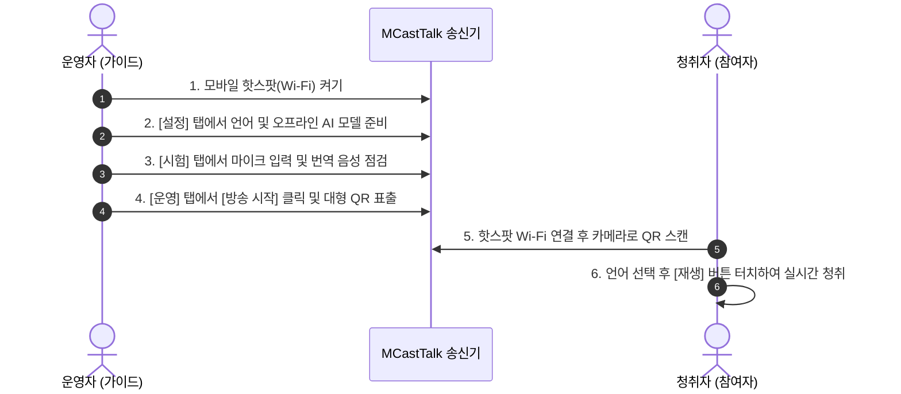

# MCastTalk 사용 설명서 허브 (User Guide Hub)

  
  
  
  
  

> **MCastTalk** — 실시간 다국어 통역방송 (feat. DMZ peace walk)  
> *Real-time Multilingual On-Device Interpretation & Broadcast Server*

MCastTalk는 외부 인터넷 연결이 없는 오지나 야외 현장(DMZ 평화 걷기 등)에서도 운영자의 스마트폰 하나로 **음성 인식(STT) → 다국어 번역 → 음성 합성(TTS) → 로컬 Wi-Fi 스트리밍**을 기기 자체에서 수행하는 온디바이스 통역 방송 솔루션입니다. 사용할 모델과 음성을 미리 준비하고 현장 네트워크에서 시험하세요. 청취자는 별도의 앱 설치 없이 카메라 QR 스캔만으로 브라우저에서 즉시 방송을 청취할 수 있습니다.

---

## 🧭 문서 내비게이션 (Documentation Directory)

목적에 맞는 세부 설명서를 선택하세요:

| 문서 (Document) | 언어 (Language) | 설명 및 주요 대상 (Summary & Audience) |
| :--- | :--- | :--- |
| **[🇰🇷 한국어 사용자 가이드](USER_GUIDE_KO.md)** | 한국어 | 운영자 기기 준비, APK 설치, 방송 운영 4단계, 청취자 참여법, 스크립트 관리 풀 가이드 |
| **[🇺🇸 English User Guide](USER_GUIDE_EN.md)** | English | Comprehensive operational guide for international organizers, operators, and listeners |
| **[🛠️ 현장 문제 해결 (한국어)](TROUBLESHOOTING_KO.md)** | 한국어 | Wi-Fi 핫스팟, 음성 지연, 마이크 하울링, 다국어 번역 오류 등 증상별 현장 복구 대응표 |
| **[🛠️ Troubleshooting (English)](TROUBLESHOOTING_EN.md)** | English | Quick triage table, latency reduction, audio feedback mitigation, and diagnostic log export |
| **[📋 배포 점검 체크리스트](PUBLISHING_CHECKLIST.md)** | 한국어 | 릴리스 전 바이너리 무결성, 보안 게이트, 오픈소스 라이선스 검증 체크리스트 |

---

## 🏗️ 온디바이스 동작 파이프라인 (Architecture Flow)

MCastTalk는 준비된 모델로 스마트폰에서 통번역을 처리하도록 설계되었습니다. 사용하는 엔진과 기기에 따라 연산 경로가 달라지며, 초기 모델 다운로드나 일부 시스템 서비스에는 인터넷이 필요할 수 있습니다.

---

## 📊 사용자 제보 시험 현황 및 권장 사양 (Hardware Matrix)

사용자가 실제 환경에서 직접 시험 후 제보한 기기별 동작 현황입니다:

| 테스트 기기 (Device) | 사용자 제보 현황 (Reported Status) | 권장 수준 (Status) |
| :--- | :--- | :--- |
| **Galaxy S26 Ultra** | **원음 외 5개 언어 동시 송출 시험 완료** (실시간 다채널 파이프라인 가동) | 🌟 플래그십 (사용자 제보 표기 보존) |
| **Galaxy S21 Ultra** | **원음 외 5개 언어 동시 송출 시험 완료** (실시간 다채널 파이프라인 정상 가동) | 🌟 고성능 플래그십 (풀 다국어 권장) |
| **Galaxy S23+** | 실기기 방송 및 통번역 시험 완료 및 안정 동작 확인 | ✅ 권장 표준 기종 |
| **Galaxy Note9** | 과거 시험 제보(지연 누적 보고) 있으나 버전 미확인 | ⚠️ 사양 미달 (공식 Android 10, minSdk 30 설치 불가) |

> [!IMPORTANT]
> **하드웨어 안내 및 주의사항**:
> - 위 매트릭스의 모든 기종은 사용자의 개별 제보 내용이며, 정밀 통제된 벤치마크 환경의 측정치가 아닙니다 (당시 사용된 정확한 APK 빌드 변종, 세부 OS 버전, 정량적 측정치는 공식 확인되지 않았습니다). Galaxy S26 Ultra는 사용자 제보 원문을 보존한 표기입니다.
> - Galaxy Note9은 공식 OS 지원이 Android 10에 머물러 있어 앱의 최소 요구사양(`minSdk 30`, Android 11 이상) 미달로 현재 정식 패키지 설치가 불가합니다. 과거 제보된 지연 현상은 당시 시험 환경 및 빌드 버전이 불명확하므로, 안정적인 송신 운영을 위해 공식 지원되는 최신 플래그십 기종(Galaxy S20 시리즈 이상) 사용을 권장합니다.
> - 음성 인식, 다국어 번역, 복수 언어 TTS 음성 합성이 동시에 실행되는 고부하 온디바이스 파이프라인이므로 **삼성 갤럭시 S20 시리즈 이상** 기기 사용을 권장합니다.

---

## 📱 청취자 인터페이스 미리보기 (UI Preview)

  
  &nbsp;&nbsp;&nbsp;&nbsp;
  

  <em>청취자는 별도의 앱 설치 없이 카메라로 QR 코드를 스캔하여 브라우저에서 즉시 통역 음성을 청취하고 실시간 자막을 확인할 수 있습니다.</em>

---

## ⚡ 빠른 시작 요약 (Quick Start)

---

## ⚖️ 오픈소스 라이선스 및 이용 안내

- **자체 작성 소스코드**: [Apache License 2.0](../LICENSE) (상업적 이용, 수정 및 재배포 자유 허용)
- **상표 및 브랜드 정책**: [BRANDING.md](../BRANDING.md) (MCastTalk 명칭/로고 사용 및 공식 보증 표시는 별도 승인 필요, 공정 이용 및 호환성 표현은 자유 허용)
- **제3자 오픈소스 고지**: [THIRD_PARTY_LICENSES.md](THIRD_PARTY_LICENSES.md) (Moonshine MIT, Gemma Apache-2.0, RNNoise BSD-3 등)
- **개발 크레딧**: Powered by Codex, Gemini with dash.jeong (Developed via AI-assisted Vibe Coding)
