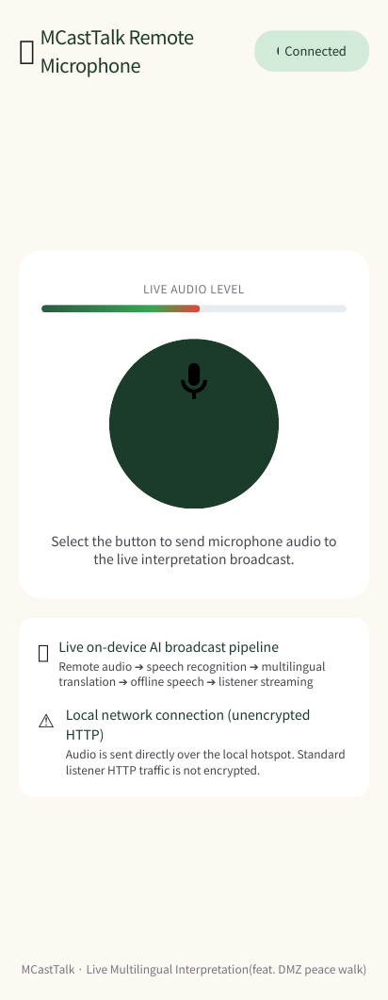
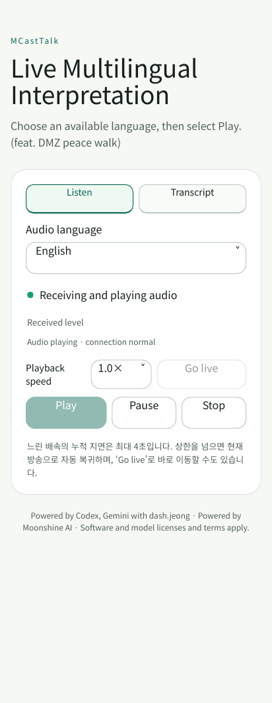

# MCastTalk User Guide

<p align="left">
  
  <a href="USER_GUIDE_KO.md"></a>
  <a href="TROUBLESHOOTING_EN.md"></a>
  <a href="../BRANDING.md"></a>
</p>

[한국어 사용자 가이드](USER_GUIDE_KO.md) · [Guide Hub](USER_GUIDE.md) · [Repository Home](../README.md) · [Troubleshooting Guide](TROUBLESHOOTING_EN.md)

---

> **"Crossing Language Barriers, Walking in Peace Together"**\
> MCastTalk is a free, open-source, on-device live interpretation and broadcast system. It was designed to empower guides, docents, tour leaders, and volunteers in outdoor environments—such as the DMZ Peace Walk—where internet access is unavailable or unreliable.
>
> Without costly dedicated transmitter/receiver hardware and without requiring listeners to install any apps, anyone can simply scan a QR code with their smartphone camera to listen to live interpreted audio and view synchronized transcripts. We warmly support everyone dedicating their efforts in the field!

This guide describes `0.2.40-alpha`, including the features in section 11. The Android operator interface is currently in Korean, so Korean menu labels are included where helpful.

---

## 1. How MCastTalk Works

After models are prepared, MCastTalk's default interpretation pipeline runs locally without external cloud servers. Separately enabled developer cloud text review is explained in section 11:

```text
[🎤 Microphone Input]
      ↓
[🎧 RNNoise AI Noise Suppression] (Real-time ambient wind & noise reduction)
      ↓
[🧠 Moonshine STT] (On-device speech recognition)
      ↓
[🌐 Gemma LiteRT / ML Kit] (Multilingual text translation)
      ↓
[🔊 Moonshine / Android TTS] (High-quality voice synthesis per language)
      ↓
[📡 Embedded Local Web Server] (Streams audio & transcripts via local Wi-Fi hotspot)
      ↓
[👥 Listener Mobile Browsers] (Zero-install web playback via QR scan)
```

> [!NOTE]
> Latency varies with the device, language and model readiness. The validation target for a Galaxy S23 with prepared models and one interpretation language is p95 at or below 2 seconds from sentence end to the first translated audio. This APK has not been measured on that physical device. For mission-critical instructions (safety, medical, or military security in controlled areas), do not rely on machine interpretation alone; verify instructions verbally and visually.

---

## 2. Preparation & Hardware Requirements

### 2.1 Operator Device & Hardware Matrix

- **Operating System**: Android 11 (API 30) or later, ARM64 architecture (Android 13+ recommended).
- **Recommended Hardware**: Because concurrent STT, translation, and multiple TTS streams run in parallel, **Samsung Galaxy S20 series or newer** is strongly recommended.

#### 📊 User-Reported Hardware Test Matrix (As of 2026-09-06)

| Device Tested | User-Reported Status | Recommendation Tier |
| :--- | :--- | :--- |
| **Galaxy S26 Ultra** | **Original audio + 5 translated languages simultaneous broadcast completed** (multichannel pipeline active) | 🌟 Flagship (User-reported write-in preserved) |
| **Galaxy S21 Ultra** | **Original audio + 5 translated languages simultaneous broadcast completed** (all pipelines normal) | 🌟 High-Performance Tier (Full multilingual recommended) |
| **Galaxy S23+** | Broadcast and multi-channel interpretation verified stable | ✅ Recommended Standard Device |
| **Galaxy Note9** | Past user report noted latency buildup; exact version unconfirmed | ⚠️ Incompatible (Stock Android 10; minSdk 30 cannot install) |

> [!IMPORTANT]
> - All models in the matrix reflect individual user write-in feedback rather than standardized laboratory benchmarks (exact APK build variants, specific OS/kernel versions, and objective quantitative metrics remain unverified in controlled environments). The "Galaxy S26 Ultra" entry preserves the user's write-in text as submitted.
> - The Galaxy Note 9 officially stops at Android 10, failing the application's minimum requirement (Android 11 / API 30+), which prevents official installation. Because the environment and build version of past latency reports were not verified, modern flagship hardware (Galaxy S20 series or newer) is recommended for reliable broadcasts.

### 2.2 Listener Requirements
- **No App Installation Required**: Works immediately on any modern smartphone browser (Chrome, Safari, Samsung Internet, Edge, Firefox).
- **Earphones / Headphones Required**: Strongly urge listeners to use earphones. Playing audio over device loudspeakers can cause acoustic feedback (howling) if picked up by the operator microphone.

### 2.3 Network Requirements
- The operator and all listeners must join the **same mobile hotspot or private local Wi-Fi network**.
- Prepare the required models and voices while online, then use a shared hotspot that allows communication between devices. Test the complete offline interpretation path before field use.

> [!CAUTION]
> On public Wi-Fi networks where "AP Client Isolation" is enabled, devices cannot communicate locally with the transmitter. Using the operator smartphone mobile hotspot (protected with WPA2/WPA3) is the most reliable approach.

---

## 3. APK Installation & Permissions

### 3.1 Verified Installation Steps

1. Download `MCastTalk-0.2.40-alpha.apk` from GitHub [Releases](https://github.com/dashjeong/MCastTalk/releases).
2. Compare the downloaded APK SHA-256 with the `.sha256` file attached to the same release.
3. Tap the APK file to install. If Android prompts **"Install unknown apps"**, temporarily grant permission for the file manager or browser, complete the installation, and open MCastTalk.
4. For security, disable the "Install unknown apps" permission after installation.

### 3.2 Required Permissions

| Permission | Purpose | Guidance |
| :--- | :--- | :--- |
| **Microphone (마이크)** | Captures voice input (built-in, wired, or Bluetooth) | **[Required]** Select "While using the app". |
| **Notifications (알림)** | Background model download & long-running broadcast status | **[Recommended]** Keeps the transmission service alive during long tours. |
| **Nearby Devices / Bluetooth** | Wireless mic, headset input & monitoring | Allow only if using a Bluetooth microphone or headset. |
| **Screen/Audio Capture** | Broadcasts audio output from another permitted app | Required only if streaming educational or media playback audio. |

---

## 4. Operator Step-by-Step Guide

### Step 1: Turn on Mobile Hotspot
1. On the operator device, go to **Settings → Connections → Mobile Hotspot and Tethering** and enable **Mobile Hotspot**.
   - Set a recognizable Network Name (SSID), e.g., `DMZ-Tour-Guide`.
   - Set a simple, memorable Wi-Fi password.
2. Launch MCastTalk. The local IP address (e.g., `http://192.168.45.1:8080`) will appear on screen.

### Step 2: Prepare Target Languages & Offline AI Models
1. Tap **Settings (설정) → Language and Model Settings (언어·모델 설정)**.
2. Select the **Source Language (원문 언어)** (Default Moonshine STT is optimized for Korean speech).
3. Check the desired **Interpretation Languages (통역 언어)** (English, Japanese, Chinese, Vietnamese, etc.).
4. Tap **Prepare (모델 준비)** or **Self-Diagnosis (번역·TTS 자체 점검)** for each language.
   - The on-device neural model will download and perform an integrity check.
   - Verify that test audio plays and the badge turns green **[Ready (준비됨)]**.

> [!TIP]
> **Prepare the day before!**\
> AI models (dozens to hundreds of megabytes) require a one-time download. Because field Wi-Fi in remote areas may be slow or nonexistent, always download and verify all language models on home/office Wi-Fi before heading out.

### Step 3: Select Audio Input & Verify Quality
1. Go to **Select Input Device (입력 장치 선택)**:
   - **Built-in Microphone (내장 마이크)**: Convenient and requires no accessories.
   - **USB-C / Wired Lavalier Mic**: Dramatically cuts wind noise when fitted with a windscreen (Strongly Recommended).
   - **Bluetooth Microphone**: Cable-free mobility, though voice quality may be compressed due to Bluetooth SCO call profile.
2. Enable **RNNoise AI Noise Reduction (RNNoise AI 마이크 소음 감소)** to filter outdoor wind and engine noise.
3. Tap **Start Input (입력 시작)** and speak. Ensure the green volume level meter moves briskly.

### Step 4: Test Interpretation & Start Broadcast
1. Tap **Interpretation Test (통번역 시험)** and speak a sample sentence.
   - Check that recognized text appears on screen and translations render cleanly.
2. Tap **Start Broadcast (방송 시작)**! The status indicator turns blue **[Broadcasting (방송 중)]**.
3. Tap **Show Listener QR Code (청취 페이지 QR 코드)** to display a full-screen QR code for participants.

<p align="center">
  
</p>

---

## 5. Listener Step-by-Step Guide

Listeners do not need to install an app; anyone with a smartphone can join in seconds:

1. **Connect Wi-Fi**: Connect to the guide hotspot (e.g., `DMZ-Tour-Guide`).
2. **Scan QR Code**: Open the default camera app and scan the QR code displayed on the guide device. Tap the yellow web link.
3. **Select Language**: Tap the language dropdown at the top (Original Audio, English, 日本語, 中文, etc.).
4. **Tap Play**: Tap the large **▶ [Play]** button in the center of the screen. The live voice begins streaming!
5. **View Transcripts**: Tap the **[Transcript]** tab to view source text and translations and browse past sentences.

<p align="center">
  
  &nbsp;&nbsp;&nbsp;&nbsp;
  
</p>

> [!IMPORTANT]
> **Crucial Tip for Listeners: Tap [Play] Manually!**\
> All modern mobile browsers (Safari, Chrome, Samsung Internet) strictly block audio from autoplaying when a page loads. **Listeners must explicitly tap the [▶ Play] button with their finger** once the page opens.

---

## 6. Field Pro-Tips for Tour Leaders & Operators

### 💡 Pro-Tip 1: Spoken Announcement Script (Read directly to your group!)
> **"Welcome everyone! Today you can listen to real-time live interpretation on your own smartphone.\
> 1. Please connect to our Wi-Fi: `[Hotspot Name]`.\
> 2. Open your camera app and scan this QR code. It opens immediately in your browser—no app download needed!\
> 3. Select your language, and make sure to tap the **[▶ Play]** button in the middle of your screen.\
> 4. For the comfort of those walking near you, please wear your earphones. Thank you, and enjoy the tour!"**

### 💡 Pro-Tip 2: Outdoor Wind & Noise Suppression
- **Microphone Placement**: Place lapel/phone microphones **5 to 10 cm diagonally below your lower lip** to prevent breathing pops and plosives.
- **Foam Windscreen**: Outdoor breeze significantly degrades AI speech recognition. A simple foam sponge windscreen over the mic element dramatically improves transcription accuracy.
- **Enunciate Sentence Endings**: AI speech segmentation relies on clear pauses and complete sentence endings. Speaking in complete, distinct clauses without trailing off substantially reduces translation latency.

### 💡 Pro-Tip 3: Battery & Thermal Management
- Running live STT, translation, and multiple TTS synthesizers concurrently uses substantial memory and compute resources; supported concurrency depends on the device and engines.
- **Keep an External Battery Connected**: For tours exceeding 2 hours, connect a 10,000–20,000 mAh external power bank.
- **Shield from Direct Sunlight**: On hot summer days, direct sunlight can trigger thermal throttling, slowing down AI inference. Keep the phone in a shaded bag pouch or remove heavy protective cases to assist heat dissipation.

### 💡 Pro-Tip 4: Eliminating Audio Feedback (Howling)
1. **Never use loudspeaker monitoring on the transmitter**: The operator should monitor audio solely via earphones if needed.
2. **Advise listeners to wear earphones**: A listener with maximum loudspeaker volume standing right next to the guide can cause microphone audio feedback loops.
3. **Keep 1 meter distance**: Maintain at least 1 meter separation from listeners playing audio.

---

## 7. Rapid Listener Triage Table (10-Second Fixes)

| Situation | Underlying Cause | Instant Resolution |
| :--- | :--- | :--- |
| **"QR scanned, but the webpage will not load!"** | Device not on hotspot, or active VPN | 1. Verify that the smartphone Wi-Fi is connected to the guide hotspot.<br>2. Temporarily turn off third-party VPN apps on the phone. |
| **"Wi-Fi keeps disconnecting and reverting to LTE/5G!"** | "Switch to mobile data" OS feature | In phone Wi-Fi advanced settings, disable **"Switch to mobile data when internet is unavailable"**. (The local tour hotspot does not connect to the public internet.) |
| **"Page says Connected, but there is no sound!"** | Browser autoplay blocked, or volume is zero | 1. Tap the **[▶ Play]** button in the center of the web player.<br>2. Turn up device **media volume** using hardware volume keys.<br>3. Check if the guide is speaking (silence is maintained when no speech is received). |
| **"Audio sounds delayed by 2 to 3 seconds!"** | Possible processing or playback delay depending on device, models, language count and connection | A delay value alone does not establish normal operation. If it keeps increasing, check per-language status and errors, then review diagnostics using the [troubleshooting guide](TROUBLESHOOTING_EN.md). |
| **"Audio suddenly stopped mid-walk!"** | Temporary Wi-Fi packet drop or distance | Tap the **[Live (실시간 복귀)]** button on the bottom right, or refresh (F5) the webpage. |

---

## 8. Glossary & Speech Recognition Hints

### 8.1 Translation Glossary (용어 사전)
- Register local historical site names or proper nouns in **Settings → Translation Glossary (번역 용어 사전)** (e.g., `도라산역` → `Dorasan Station`).
- Saved entries apply immediately to subsequent sentences.
- Bulk import/export is supported using UTF-8 CSV templates.

### 8.2 Recognition Correction Hints
- Add specific phonetic hints for words frequently misheard by speech recognition.
- Profiles can be exported as clean files to share with fellow guides and tour coordinators.

---

## 9. Wrapping Up & Security

1. At the conclusion of your tour, tap **Stop Broadcast (방송 중지)** first, then tap **Stop Input (입력 중지)**.
2. Once participants have disconnected, turn off your mobile hotspot.
3. Hide unneeded scripts in **Broadcast Transcript Storage (방송 스크립트 보관함)**. Hiding is not complete deletion: daily backups and previously exported ZIP files remain. Manage the retention and sharing of those backup files separately when they contain private content.

---

## 10. Technical Support & Feedback

If issues persist, please consult our [Field Troubleshooting Guide](TROUBLESHOOTING_EN.md).

To report bugs or suggest enhancements, please open an issue on [GitHub Issues](https://github.com/dashjeong/MCastTalk/issues). Thank you for walking with us!

## 11. Using the 0.2.40 additions

### Interpret on one device

Choose **Usage mode (사용 방식) → Use on this device (이 기기에서 사용) → Start standalone (단독 사용 시작)** to use local interpretation and transcripts without Wi-Fi or a hotspot. Prepare the required models and language packs first. Enable device output to listen, preferably through earphones to prevent feedback. Standalone mode provides no listener web address, QR code or remote web microphone. To share with participants, stop the session, select **Broadcast to other devices (다른 기기에 방송)** and prepare a shared network. Input controls remain independent of session controls.

For device playback capture, selecting an app also fills its package name. A manually edited package name takes priority when starting input; selecting another app fills that new app's package name. This does not bypass capture restrictions imposed by the source app.

### Focus on the transcript

Open **Switch view / full-screen transcript (화면 전환 · 전체 화면 스크립트)** from the operator screen. Choose large text, the original with one or all translations, and whether to follow the newest sentence. Scroll back to read earlier content. Opening or leaving this view does not change input or broadcast state. In **Broadcast transcript archive (방송 스크립트 보관함)**, find sessions by their broadcast start date and time.

### Convert multiple files and listen alongside text

1. Open **Test → File conversion / playback (번역 시험 · 파일 변환 / 재생)** and choose one file, **Multiple files (여러 파일 선택)** or **Folder (폴더 선택)**. MP3, MP4, M4A and WAV audio tracks require a decoder supported by the device. Split very large folders into smaller selections.
2. Choose the source and translation languages for the selected batch. With no translation language selected, only the original transcript is saved. New file transcription requires Android 13 or later and a compatible on-device speech service. Choose the source language manually on Android 13, or whenever Android 14+ reports automatic detection unavailable.
3. Stop live input, broadcasting and interpretation tests before conversion. A failed file or translation language does not discard completed transcripts or other translations. After resolving the problem, use **Retry failed items (실패 항목 재작업)** or **Retry this file (이 파일 재작업)**. A content hash identifies the same file so compatible saved transcripts and translations can be reused.
4. Open **Transcript playback (스크립트 재생)** to hear the original with its text. **Playback settings (재생 설정)** includes speed, repeat, previous/next file and translation language. If the file moved or permission expired, use **Find original file again (원본 파일 다시 찾기)**. Only matching file content can be linked to the saved transcript.

When word start times are available, playback highlights the current word. Otherwise it highlights a sentence segment. **Estimated timing (시각 추정)** does not promise precise word boundaries. Check recognition and translation accuracy against the original audio. Deleting a saved transcript leaves the original audio file intact.

### Back up and move data to another device

Open **Settings → Data import / export (데이터 가져오기 · 내보내기)** to back up settings,
dictionaries and scripts separately. Export runs only when selected and creates a new ZIP in the
device's **Download/MCastTalk/Backups** folder. Earlier backups remain intact. Completion is shown
after saving finishes; fix storage problems and use **Retry (재작업)** if a task fails or is cancelled.

- **Settings:** includes languages, broadcast mode, display, voice selection and experimental
  options. API keys, passwords, PINs and certificates are excluded. Cloud review and automatic
  learning require renewed consent after import.
- **Dictionary:** includes term overrides, recognition corrections and human/AI sentence memory.
  Current human-confirmed entries take priority over matching backup entries.
- **Scripts:** includes all saved broadcast records and queryable daily backups, file transcripts,
  translations, timing and file-link metadata. Move original audio separately, then use **Find file
  (파일 찾기)** in playback. Only content with the matching hash can be linked to a saved script.

Transfer the ZIP to the other device and select **Import (가져오기)** for the same backup kind.
The app validates format version, integrity and record relationships before merging with existing
data. Compatible extra fields are tolerated; unsupported major formats or damage are reported
before applying records. An interrupted merge can be retried with the same file. Backups may
contain personal sentences; check their content before sharing. The app does not automatically
send backups to an external server.

### Enable developer features only when needed

**Settings → Show developer information (개발자 정보 표시)** is off by default. Normal screens emphasize content and controls; processing times, PCM and frame details appear only when enabled. Actionable errors, permission guidance and minimal diagnostic export remain available.

This setting reveals **Developer lab (개발자 실험실 · 표현 TTS / 의역 / API)**. Expression experiments make small rate/pitch changes to installed Android voices; they do not clone the original emotion. Register/paraphrasing requires a prepared Gemma engine actually used by the selected path or a separately authorized API. ML Kit alone does not apply it. Cloud review requires a saved key and transmission consent; source text, translation and language information go to the selected provider and may incur charges. Live review also requires automatic learning, and saved results apply to later matching sentences.

Use **Settings → Sentence dictionary (문장·회화 사전 · 확인 / 수정)** to inspect, edit and confirm phrases. Human-confirmed translations work offline and cannot be overwritten by AI results. Learning adds entries to the device dictionary; it does not retrain model weights. See the [developer lab and sentence memory guide](DEVELOPER_LAB.md) for review and data-transfer scope.

Automated and virtual-device checks do not establish physical Galaxy/One UI behavior, outdoor performance, actual Android/iPhone listening or eight-hour continuous stability. Test the complete path in your environment before use and consult the [test report](TEST_REPORT.md) for the exact validation scope.
