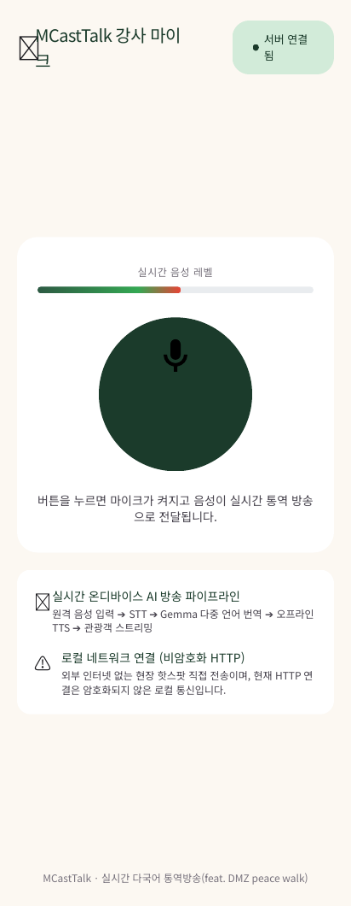

# MCastTalk 사용자 가이드 (User Guide)

<p align="left">
  
  <a href="USER_GUIDE_EN.md"></a>
  <a href="TROUBLESHOOTING_KO.md"></a>
  <a href="../BRANDING.md"></a>
</p>

[English User Guide](USER_GUIDE_EN.md) · [가이드 허브](USER_GUIDE.md) · [저장소 홈](../README.md) · [현장 문제 해결](TROUBLESHOOTING_KO.md)

---

> **"언어의 장벽을 넘어, 모두가 함께 걷고 평화를 나누는 길"**\
> MCastTalk는 인터넷 연결이 불가능한 비무장지대(DMZ) 평화 걷기 현장이나 야외 투어에서도, 운영자의 스마트폰 한 대로 **온디바이스(기기 자체 연산)** 통역 방송을 송출할 수 있도록 제작된 무료 오픈소스 솔루션입니다.\
>
> 고가의 전용 송수신기나 복잡한 통역 장비 없이, 그리고 청취자의 번거로운 앱 설치 없이 카메라 QR 스캔만으로 누구나 실시간 통역 음성과 자막을 함께 누릴 수 있습니다. 현장에서 애쓰시는 가이드, 인솔자, 자원봉사자 여러분을 진심으로 응원합니다!

이 안내서는 MCastTalk `0.2.39-alpha` 버전을 기준으로 작성되었습니다.

---

## 1. MCastTalk 동작 원리 한눈에 보기

MCastTalk는 클라우드 서버나 외부 인터넷 연결 없이 오직 스마트폰 내부 연산으로만 작동합니다:

```text
[🎤 마이크 입력]
      ↓
[🎧 RNNoise AI 소음 제거] (주변 바람·소음 실시간 억제)
      ↓
[🧠 Moonshine STT] (기기 내 온디바이스 음성인식)
      ↓
[🌐 Gemma LiteRT / ML Kit] (다국어 텍스트 번역)
      ↓
[🔊 Moonshine / Android TTS] (언어별 고음질 음성 합성)
      ↓
[📡 내장 로컬 웹 서버] (로컬 Wi-Fi 핫스팟으로 오디오 & 자막 실시간 스트리밍)
      ↓
[👥 청취자 모바일 브라우저] (앱 설치 없이 QR 스캔으로 즉시 청취)
```

> [!NOTE]
> 온디바이스 AI 특성상 음성인식, 번역, 음성합성 과정에 약간의 처리 지연(약 1~2초 내외)이 발생합니다. 안전 안내, 의료, 군사 통제 구역 등 생명과 안전에 직결된 주요 안내는 통역 음성에만 의존하지 마시고 운영자가 육성 및 시각적 수단으로 함께 확인해 주시기 바랍니다.

---

## 2. 사용 전 준비 & 권장 하드웨어

### 2.1 운영자 기기 사양 및 실기기 검증 결과

- **운영체제**: Android 11(API 30) 이상 ARM64 기기 (Android 13 이상 권장)
- **권장 기종**: 복수의 언어를 실시간 번역·합성해야 하므로 **삼성 갤럭시 S20 시리즈 이상**을 강력히 권장합니다.

#### 📊 사용자 제보 시험 현황 (2026-09-06 기준)

| 테스트 기종 | 사용자 제보 시험 현황 | 권장 수준 |
| :--- | :--- | :--- |
| **Galaxy S26 Ultra** | **원음 외 5개 언어 동시 송출 시험 완료** (실시간 다채널 파이프라인 가동) | 🌟 플래그십 (사용자 제보 표기 보존) |
| **Galaxy S21 Ultra** | **원음 외 5개 언어 동시 송출 시험 완료** (실시간 다채널 파이프라인 정상 가동) | 🌟 고성능 플래그십 (풀 다국어 권장) |
| **Galaxy S23+** | 실기기 방송 및 통번역 시험 완료 및 안정 동작 확인 | ✅ 권장 표준 기종 |
| **Galaxy Note9** | 과거 시험 제보(지연 누적 보고) 있으나 버전 미확인 | ⚠️ 사양 미달 (공식 Android 10, minSdk 30 설치 불가) |

> [!IMPORTANT]
> - 위 매트릭스의 모든 기종은 사용자의 개별 제보 내용이며, 정밀 통제된 벤치마크 환경의 측정치가 아닙니다 (당시 사용된 정확한 APK 빌드 변종, 세부 OS 버전, 정량적 측정치는 공식 확인되지 않았습니다). Galaxy S26 Ultra는 사용자 제보 원문을 보존한 표기입니다.
> - Galaxy Note9은 공식 OS가 Android 10에 머물러 있어 앱의 최소 지원 사양(Android 11 / minSdk 30 이상) 미달로 현재 정식 설치가 불가합니다. 과거 제보된 지연 현상은 당시 시험 환경 및 빌드 버전이 불명확하므로, 안정적인 송신 운영을 위해 공식 지원되는 최신 플래그십 기종(Galaxy S20 시리즈 이상) 사용을 권장합니다.

### 2.2 청취자 준비물
- 별도의 전용 앱 설치는 전혀 필요하지 않습니다.
- 최신 웹 브라우저(Chrome, Safari, Samsung Internet 등)를 사용하고, 현장에서 사용할 기기로 접속과 재생을 먼저 시험하세요.
- **이어폰/헤드폰 착용 필수**: 참가자가 스피커로 재생할 경우 운영자의 마이크로 소리가 다시 흘러들어가 삐~ 하는 하울링(반복음)이 발생할 수 있으므로, 반드시 이어폰 착용을 안내해 주세요.

### 2.3 네트워크 환경
- 운영자와 청취자가 **동일한 모바일 핫스팟 또는 사설 Wi-Fi**에 연결되어 있어야 합니다.
- 사용할 모델과 음성을 인터넷 연결 상태에서 미리 준비한 뒤, 기기 간 통신이 가능한 같은 핫스팟에서 오프라인 방송을 사용할 수 있습니다. 현장 사용 전에 전체 통번역 경로를 시험하세요.

> [!CAUTION]
> 공공 Wi-Fi 공유기 중 '게스트 격리(AP Isolation)' 기능이 켜져 있는 네트워크에서는 기기 간 통신이 차단되어 청취자가 접속하지 못할 수 있습니다. 운영자 기기의 **모바일 핫스팟(WPA2/WPA3 암호 설정)**을 직접 켜서 운영하시는 것을 가장 권장합니다.

---

## 3. APK 설치 및 초기 권한 설정

### 3.1 안전한 설치 단계

1. GitHub 저장소의 [Releases](https://github.com/dashjeong/MCastTalk/releases)에서 검증된 `MCastTalk-0.2.39-alpha.apk` 파일을 다운로드합니다.
2. 다운로드한 파일의 SHA-256을 같은 릴리스에 첨부된 `.sha256` 파일과 대조합니다.
3. APK 파일을 터치하여 설치를 진행합니다. Android 시스템이 **'출처를 알 수 없는 앱 설치'** 허용을 요청하면, 설치를 진행하는 브라우저나 파일 관리자에 한해 **'이번만 허용'** 또는 임시 허용 후 설치합니다.
4. 설치가 완료되면 보안을 위해 해당 권한을 다시 비활성화해 주세요.

### 3.2 앱 권한 안내

| 요청 권한 | 사용 목적 | 안내 및 권장 사항 |
| :--- | :--- | :--- |
| **마이크 (Microphone)** | 운영자 음성 입력 수신 (내장, 유선, Bluetooth) | **[필수]** 음성 방송을 위해 반드시 '앱 사용 중에만 허용'을 선택하세요. |
| **알림 (Notification)** | 백그라운드 모델 준비 및 장시간 방송 상태 유지 | **[권장]** 방송 중 앱이 절전 모드로 종료되지 않도록 허용을 권장합니다. |
| **주변 기기 / Bluetooth** | 무선 마이크, 헤드셋 입력 및 모니터링 | Bluetooth 무선 마이크를 사용할 경우에만 허용하시면 됩니다. |
| **화면·앱 오디오 캡처** | 기기 내 다른 앱의 오디오 재생음 송출 | 다른 교육 앱이나 미디어 소리를 송출할 때만 시스템 팝업에서 허용합니다. |

---

## 4. 단계별 사용법: 운영자 (가이드 / 인솔자)

### 1단계: 네트워크 핫스팟 켜기
1. 스마트폰의 **[설정] → [연결] → [모바일 핫스팟 및 테더링]**에서 **모바일 핫스팟**을 켭니다.
   - 네트워크 이름(SSID)을 참가자들이 찾기 쉽게 설정하세요. (예: `DMZ-Tour-Guide`)
   - 비밀번호는 외우기 쉬운 영문/숫자로 지정합니다.
2. MCastTalk 앱을 실행하면 상단에 로컬 IP 주소(예: `http://192.168.45.1:8080`)가 정상적으로 감지되어 표시됩니다.

### 2단계: 통역 언어 및 오프라인 AI 모델 준비
1. 앱 하단의 **[설정] → [언어·모델 설정]** 메뉴로 들어갑니다.
2. **원문 언어**를 선택합니다. (기본 내장 Moonshine STT는 한국어 음성을 초고속 인식합니다.)
3. 청취자에게 제공할 **통역 언어**(영어, 일본어, 중국어, 베트남어 등)를 체크합니다.
4. 각 언어별 **[모델 준비]** 또는 **[번역·TTS 자체 점검]**을 누릅니다.
   - 온디바이스 모델 파일이 기기에 다운로드되고 무결성이 검증됩니다.
   - 시험 합성 음성이 정상 출력되고 상태가 초록색 **[준비됨]**으로 바뀌는지 확인합니다.

> [!TIP]
> **전날 미리 준비하세요!**\
> AI 모델 파일(수십~수백 MB)은 최초 1회 다운로드가 필요합니다. 행사 당일 인터넷이 느린 야외에서는 다운로드가 어려우므로, 반드시 행사 전날 Wi-Fi 환경에서 미리 모든 언어 모델을 다운로드하고 [준비됨] 상태를 확인해 주세요.

### 3단계: 마이크 입력 장치 선택 및 음질 점검
1. **[입력 장치 선택]** 메뉴에서 사용할 장치를 선택합니다:
   - **내장 마이크**: 별도 장비 없이 간편하게 사용할 때 적합합니다.
   - **USB-C / 유선 마이크**: 윈드스크린이 달린 외장 마이크 연결 시 야외 바람 소리를 극적으로 줄여줍니다. (강력 권장)
   - **Bluetooth 마이크**: 선 없이 자유롭게 이동할 때 편리하나, 통화 프로필(SCO) 특성상 음질이 다소 거칠어질 수 있습니다.
2. **RNNoise AI 마이크 소음 감소** 옵션을 켭니다. 야외 바람 소리나 자동차 소음을 깨끗하게 걸러줍니다.
3. **[입력 시작]**을 누르고 마이크에 말을 해봅니다. 녹색 음량 바가 힘차게 움직이는지 확인하세요.

### 4단계: 통번역 시험 및 방송 시작
1. **[통번역 시험]**을 눌러 실제 안내 멘트를 한두 문장 말해봅니다.
   - 화면에 실시간 음성인식 문장이 정확히 뜨고, 번역 결과가 나오는지 점검합니다.
2. 이상이 없다면 **[방송 시작]** 버튼을 누릅니다! 상태가 파란색 **[방송 중]**으로 전환됩니다.
3. 화면의 **[청취 페이지 QR 코드]**를 터치하여 대형 화면으로 띄운 후 참가자들에게 보여줍니다.

<p align="center">
  
</p>

---

## 5. 단계별 사용법: 청취자 (투어 참가자)

청취자는 앱을 설치할 필요가 없어 어르신이나 외국인 관광객도 매우 쉽게 참여할 수 있습니다.

1. **와이파이 연결**: 가이드가 안내하는 모바일 핫스팟(예: `DMZ-Tour-Guide`)에 스마트폰 Wi-Fi를 연결합니다.
2. **QR 코드 스캔**: 스마트폰 기본 카메라 앱을 켜고 가이드 스마트폰 화면의 QR 코드를 비춥니다. 노란색 링크가 뜨면 터치합니다.
3. **언어 선택**: 열린 웹페이지 상단에서 듣고 싶은 언어(한국어 원음, English, 日本語, 中文 등)를 선택합니다.
4. **재생 터치**: 화면 가운데의 **▶ [재생]** 버튼을 터치합니다. 가이드의 육성 또는 통역 음성이 흘러나옵니다!
5. **실시간 자막 확인**: 상단의 **[통역 스크립트]** 탭에서 원문과 번역본을 확인하고 지난 문장을 다시 읽을 수 있습니다.

<p align="center">
  
  &nbsp;&nbsp;&nbsp;&nbsp;
  
</p>

> [!IMPORTANT]
> **"소리가 안 나와요!" 하실 때 1초 해결법**:\
> 스마트폰 브라우저(Chrome, Safari 등)는 데이터 절약을 위해 웹페이지가 열릴 때 자동으로 소리가 재생되는 것을 차단합니다. 따라서 페이지가 열린 후 **반드시 청취자가 화면의 [재생] 버튼을 손가락으로 직접 터치**해 주셔야 소리가 나옵니다.

---

## 6. 현장 운영자를 위한 실전 꿀팁 (Pro-Tips)

현장에서 돌발 상황 없이 매끄러운 진행을 돕기 위해 축적된 실전 노하우입니다.

### 💡 꿀팁 1: 현장 참가자 안내 육성 멘트 (그대로 읽으시면 됩니다!)
> **"참가자 여러분, 잠시 안내 말씀 드리겠습니다!\
> 오늘 투어는 개인 스마트폰으로 실시간 통역과 해설을 무료로 들으실 수 있습니다.\
> 1. 휴대폰 Wi-Fi 설정에서 `[핫스팟 이름]`을 연결해 주세요.\
> 2. 카메라를 켜서 제가 들고 있는 QR 코드를 비추시면 별도 앱 설치 없이 바로 웹페이지가 열립니다.\
> 3. 원하시는 언어를 고르신 후, 화면 가운데 **[재생]** 버튼을 꼭 터치해 주세요.\
> 4. 주변 분들과 안전한 보행을 위해 이어폰 착용을 부탁드립니다. 감사합니다!"**

### 💡 꿀팁 2: 야외 바람 소리 및 주변 소음 완벽 차단법
- **마이크 위치**: 스마트폰이나 핀마이크는 입술에서 **5~10cm 대각선 아래**에 위치시키는 것이 숨소리와 파열음(ㅍ, ㅌ 소리)을 막는 최적의 위치입니다.
- **윈드스크린(마이크 솜) 착용**: 야외 투어 시 바람 소리는 음성인식 정확도를 떨어뜨리는 주원인입니다. 저렴한 스펀지 폼 윈드스크린을 마이크에 씌우면 음질이 획기적으로 개선됩니다.
- **또박또박 말끝 맺기**: AI 음성인식은 문장 끝(예: "~습니다", "~요")이 분명할 때 문장을 빠르게 확정하고 다음 번역으로 넘깁니다. 말끝을 흐리지 않고 자연스럽게 쉬어가며 말씀해 주시면 번역 지연이 크게 줄어듭니다.

### 💡 꿀팁 3: 배터리 및 스마트폰 발열 안심 관리
- 4~5개 언어를 실시간 통역하는 것은 메모리와 연산 자원을 많이 사용하는 작업이며, 처리 가능한 언어 수는 기기와 엔진에 따라 달라집니다.
- **보조배터리 상시 연결**: 2시간 이상 투어 시에는 10,000~20,000mAh 고속 보조배터리를 유선 연결해 두세요.
- **직사광선 피하기**: 한여름 야외에서 스마트폰이 햇빛에 직접 노출되면 과열 보호 기능으로 AI 처리 속도가 느려질 수 있습니다. 가이드 가방의 그늘진 포켓에 넣거나 스마트폰 케이스를 벗겨 방열을 돕는 것이 좋습니다.

### 💡 꿀팁 4: 하울링(삐~ 소리) 원천 차단 3원칙
1. **운영자 모니터링은 무조건 이어폰으로**: 송신기 스마트폰에서 소리가 스피커로 나오면 마이크로 다시 들어가 무한 루프 하울링이 발생합니다. 운영자는 필요 시 이어폰 한쪽만 착용하세요.
2. **청취자 이어폰 권장**: 청취자 중 한 분이라도 스마트폰 스피커 볼륨을 최대로 올린 채 가이드 옆에 바짝 붙으면 하울링이 발생할 수 있습니다.
3. **가이드와 청취자 간 최소 1m 이상 거리 유지**: 스피커를 켠 청취자와는 최소 1m 이상의 거리를 유지해 주세요.

---

## 7. 청취자 현장 응대 FAQ (10초 긴급 조치표)

| 현장 문의 상황 | 원인 | 즉각 조치 방법 |
| :--- | :--- | :--- |
| **"QR을 찍었는데 화면이 안 열려요!"** | Wi-Fi 연결 누락 또는 모바일 데이터 간섭 | 1. 가이드 핫스팟에 Wi-Fi가 제대로 연결되었는지 확인합니다.<br>2. 스마트폰 설정에서 사설 VPN 앱이 켜져 있다면 잠시 끕니다. |
| **"와이파이가 자꾸 끊기고 LTE로 넘어가요!"** | 스마트폰의 '스마트 네트워크 전환' 기능 | 스마트폰 Wi-Fi 고급 설정에서 **'인터넷 연결이 불안정할 때 모바일 데이터로 자동 전환'** 옵션을 꺼주세요. (핫스팟 자체는 외부 인터넷이 없는 로컬망이기 때문입니다.) |
| **"화면은 연결됨인데 아무 소리도 안 나요!"** | 브라우저 자동재생 차단 또는 볼륨 0 | 1. 화면 중앙의 **[▶ 재생]** 버튼을 다시 한번 터치합니다.<br>2. 스마트폰 본체 옆면의 **미디어 음량**을 올립니다.<br>3. 가이드가 현재 말을 하고 있는지 확인합니다. (무음 상태에서는 소리가 나지 않습니다.) |
| **"방송이 2~3초 뒤에 늦게 들려요!"** | 정상적인 온디바이스 AI 통역 지연 | 기기 내 실시간 음성인식 + 번역 + 음성합성 파이프라인 처리에 소요되는 자연스러운 지연입니다. 정상 동작입니다. |
| **"듣다가 소리가 갑자기 끊겼어요!"** | 일시적 버퍼 지연 또는 Wi-Fi 일탈 | 화면 우측 하단의 **[실시간 복귀]** 버튼을 누르거나, 웹페이지를 새로고침(F5)합니다. |

---

## 8. 용어 사전 및 음성인식 교정 기능 활용

지역 고유명사나 사찰, 유적지 이름 등 특수한 어휘는 미리 등록해 두면 정확도가 비약적으로 올라갑니다.

### 8.1 번역 용어 사전 (Glossary)
- **[설정] → [번역 용어 사전]**에서 언어별 원어와 번역어를 1:1로 등록할 수 있습니다. (예: `도라산역` → `Dorasan Station`)
- 등록된 단어는 다음 문장 번역부터 즉시 적용됩니다.
- 대량 등록 시에는 제공되는 템플릿 양식의 UTF-8 CSV 파일로 일괄 가져오기가 가능합니다.

### 8.2 음성인식 교정 힌트
- 인식 엔진이 자주 혼동하는 발음이나 현장 특화 고유명사를 교정 힌트로 등록할 수 있습니다.
- 교정 프로필은 파일로 내보내기/가져오기가 가능하므로 동료 가이드와 설정을 공유할 수 있습니다.

---

## 9. 행사 종료 및 안전한 마무리

1. 투어가 끝나면 앱에서 **[방송 중지]** 버튼을 먼저 누른 후, **[입력 중지]**를 누릅니다.
2. 참가자들의 연결이 모두 해제된 것을 확인한 뒤 스마트폰의 모바일 핫스팟을 끕니다.
3. 개인정보 및 현장 발언 보안을 위해, 보관이 불필요한 스크립트는 **[방송 스크립트 보관함]**에서 해당 세션을 깨끗이 삭제합니다.

---

## 10. 기술 지원 및 문의

사용 중 이상 증상이 지속되거나 기기별 특이사항이 발생한 경우 [현장 문제 해결 가이드](TROUBLESHOOTING_KO.md)를 먼저 확인해 주세요.

버그 리포트나 개선 제안은 [GitHub Issues](https://github.com/dashjeong/MCastTalk/issues)에 등록해 주시면 더욱 발전된 서비스로 보답하겠습니다. 함께해 주셔서 진심으로 감사드립니다!
